# Traffic Scout — End-to-End Scenario

## Use case

**Traffic Scout** is a simulation model developed by Transport and Mobility Leuven (TML).
A Traffic Scout model is configured and calibrated for a specific region using
model-specific data sources and input from the client. It supports scenario calculations
of multimodal traffic flows at the mesoscopic level.

<!-- TML COMMENT: Question: does mocat:SimulationModel
represent Traffic Scout in general, or a configured and calibrated model for a specific
region, such as x-CITE Kortrijk?
Each regional model is set up specifically for that region with the available datasources
and with the special needs/requests of the clients incorporated. For scenarios, that
basis state is fixed, together with the software version, such that
identical scenario runs produce identical results. How should the regional model, the
software version, and their relationship be represented in MOCAT? -->

This example documents a single illustrative simulation run for the configured and calibrated
Traffic Scout model for x-CITE Kortrijk, using MoCAT's three-layer model to capture the plan,
the execution, and the data artefacts.

---

## Three-layer structure

```mermaid
flowchart TD
    subgraph PLAN["PLAN LAYER"]
        direction TB
        M(["`**SimulationModel**
        traffic-scout`"]):::plan
        IS(["`**DataSpec** (input)
        TransportNetworkSchema`"]):::spec
        ODIS(["`**DataSpec** (input)
        OriginDestinationMatrixSchema`"]):::spec
        RCIS(["`**DataSpec** (input)
        RunConfigurationSchema`"]):::spec
        OS(["`**DataSpec** (output)
        SimulationOutputSchema`"]):::spec
        M -->|mocat:input| IS
        M -->|mocat:input| ODIS
        M -->|mocat:input| RCIS
        M -->|mocat:output| OS
    end

    subgraph EXEC["EXECUTION LAYER"]
        R(["`**SimulationRun**
        run-001`"]):::run
        A(["`**Agent** (mocat:Agent)
        traffic-scout`"]):::agent
        R -->|prov:wasAssociatedWith| A
    end

    subgraph DATA["DATA LAYER"]
        DI(["`**Dataset** (input)
        xcite-kortrijk-network`"]):::data
        DOD(["`**Dataset** (input)
        xcite-kortrijk-od-demand`"]):::data
        DRC(["`**Dataset** (input)
        run-001-configuration`"]):::data
        DO(["`**Dataset** (output)
        traffic-scout-output-run-001`"]):::data
    end

    R -->|p-plan:correspondsToStep| M
    R -->|prov:used| DI
    R -->|prov:used| DOD
    R -->|prov:used| DRC
    R -->|prov:generated| DO
    DI -->|mocat:conformsToSpecification| IS
    DOD -->|mocat:conformsToSpecification| ODIS
    DRC -->|mocat:conformsToSpecification| RCIS
    DO -->|mocat:conformsToSpecification| OS

    classDef plan   fill:#BFDBFE,stroke:#2563EB,color:#000
    classDef run    fill:#BBF7D0,stroke:#16A34A,color:#000
    classDef data   fill:#FED7AA,stroke:#EA580C,color:#000
    classDef spec   fill:#DDD6FE,stroke:#7C3AED,color:#000
    classDef agent  fill:#E0F2FE,stroke:#0284C7,color:#000
```

<!-- TML COMMENT: The example currently lacks a separate scenario input describing the
interventions to be calculated. For example, a scenario can make a selected street
inaccessible to bicycle traffic. Could you add a suitable input data specification and
dataset for this scenario input, and link them to the simulation model and run? The scenario
input contains the requested changes, not a complete replacement transport network. Some
changes can have an applicable period, but this is not required for every change. -->

---

## Plan layer

### SimulationModel — `omg-simulationmodel:traffic-scout`

The model is typed as `mocat:SimulationModel` (which implies `prov:Plan`, `p-plan:Plan`,
and `p-plan:Step`). It carries DCAT metadata (title, description, keywords, publisher,
issued, modified) and declares its expected inputs and outputs via `mocat:input` and
`mocat:output`.

| Property | Value |
|----------|-------|
| `dcterms:title` | "Traffic Scout" |
| `dcterms:publisher` | Transport and Mobility Leuven |
| `mocat:input` | `omg-schema:TransportNetworkSchema` |
| `mocat:input` | `omg-schema:OriginDestinationMatrixSchema` |
| `mocat:input` | `omg-schema:RunConfigurationSchema` |
| `mocat:output` | `omg-schema:SimulationOutputSchema` |

### DataSpecification — `omg-schema:TransportNetworkSchema`

Describes the required structure of the input dataset. Typed as `mocat:DataSpecification`
(a `p-plan:Variable`). Domain data validation is expressed via `sh:node` links to SHACL
NodeShapes.

| Shape | Target class | Key constraints |
|-------|-------------|-----------------|
| `omg-shacl:TransportVertexShape` | `ex:TransportVertex` | `dcterms:identifier` (integer, exactly 1), `ex:geom` (WKT, exactly 1) |
| `omg-shacl:TransportEdgeShape` | `ex:TransportEdge` | `dcterms:identifier` (integer, exactly 1), `ex:length` (double, 1), `ex:fromNode`/`ex:toNode` (vertex, 1), `ex:geom` (WKT, 1), `ex:legalSpeedLimit` (integer, 1), `ex:carAccessible`/`ex:truckAccessible`/`ex:bicycleAccessible` (boolean, 1 each) |
| `omg-shacl:TurnMovementShape` | `ex:TurnMovement` | `dcterms:identifier` (integer, exactly 1), `ex:fromNode`/`ex:viaNode`/`ex:toNode` (vertex, 1), `ex:carAccessible`/`ex:truckAccessible`/`ex:bicycleAccessible` (boolean, 1 each) |
| `omg-shacl:TransportZoneShape` | `ex:TransportZone` | `dcterms:identifier` (integer, exactly 1), `ex:geom` (WKT, exactly 1) |

<!-- TML COMMENT: Traffic Scout refers to graph vertices as nodes and uses fromNode and
toNode for the endpoints of a directed edge. A turn movement is defined by a sequence
of fromNode, viaNode, and toNode. The fromNode-viaNode and viaNode-toNode combinations must
each correspond to an edge in the same transport network. Could you add checks for this
and for the uniqueness of the vertex, edge, and turn movement identifiers? We have
intentionally limited the table to structurally important properties and a few
representative attributes (for now). -->

### DataSpecification — `omg-schema:OriginDestinationMatrixSchema`

Describes traffic demand between origin and destination zones for a given transport mode
and hour.

| Shape | Target class | Key constraints |
|-------|-------------|-----------------|
| `omg-shacl:OriginDestinationDemandShape` | `ex:OriginDestinationDemand` | `ex:origin`/`ex:destination` (transport zone, 1), `ex:transportMode` (string, 1), `ex:hour` (integer, 1), `ex:demand` (double, 1) |

<!-- TML COMMENT: The referenced origin and destination zones must correspond
to zones in the transport network. Please adjust the RDF names if another MOCAT convention
is more appropriate. -->

### DataSpecification — `omg-schema:RunConfigurationSchema`

Describes the simulation hours selected for a run.

| Shape | Target class | Key constraints |
|-------|-------------|-----------------|
| `omg-shacl:RunConfigurationShape` | `ex:RunConfiguration` | `ex:simulationHour` (integer, one or more) |

<!-- TML COMMENT: A regional Traffic Scout model is configured in advance for a defined
set of hours and transport modes. A run selects one or more of the supported hours, while
the transport modes and fixed calibration and assignment parameters remain part of the
configured model. Is this the appropriate separation in MOCAT? Or would it be better to
combine this with the scenario intervention input? -->

### DataSpecification — `omg-schema:SimulationOutputSchema`

Describes the structure of the output dataset.

| Shape | Target class | Key constraints |
|-------|-------------|-----------------|
| `omg-shacl:SimulationOutputShape` | `ex:TrafficFlowResult` | `ex:transportEdge` (transport edge, 1), `ex:transportMode` (string, 1), `ex:hour` (integer, 1), `ex:flow` (double, 1) |

<!-- TML COMMENT: Traffic Scout calculates numeric traffic flows for each directed link,
transport mode, and simulation hour. -->

---

## Execution layer

### Agent — `omg-agent:traffic-scout`

Typed as `mocat:Agent` (which implies `prov:SoftwareAgent` and `spdx-sw:Package`).
The Agent represents the specific Traffic Scout software version used to execute the
configured regional model. Recording this version supports reproducible simulation runs.

| Property | Value |
|----------|-------|
| `foaf:name` | "Traffic Scout" |
| `spdx-sw:primaryPurpose` | `spdx-purpose:application` |

<!-- TML COMMENT: The GitHub package and release references were removed because Traffic
Scout is not distributed there. MOCAT currently appears to require spdx-sw:packageVersion.
Each regional model is linked internally to a compatible Traffic Scout software version
for reproducibility. Since this version is an internal operational identifier rather than
a public software release, is it useful and appropriate to include it in the public
metadata, or should this property be optional for software that is not publicly distributed? -->

### SimulationRun — `omg-simulationrun:run-001`

Typed as `mocat:SimulationRun` (which implies `prov:Activity` and `p-plan:Activity`).
Links back to the model via `p-plan:correspondsToStep` and to the software agent via
`prov:wasAssociatedWith`.

| Property | Value |
|----------|-------|
| `p-plan:correspondsToStep` | `omg-simulationmodel:traffic-scout` |
| `sosa:usedProcedure` | `omg-simulationmodel:traffic-scout` (SOSA compatibility) |
| `prov:wasAssociatedWith` | `omg-agent:traffic-scout` |
| `prov:used` | `omg-dataset:xcite-kortrijk-network` (input) |
| `prov:used` | `omg-dataset:xcite-kortrijk-od-demand` (input) |
| `prov:used` | `omg-dataset:run-001-configuration` (input) |
| `prov:generated` | `omg-dataset:traffic-scout-output-run-001` (output) |

---

## Data layer

### Input dataset — `omg-dataset:xcite-kortrijk-network`

The configured routable transport network for the x-CITE Kortrijk model, prepared using
OpenStreetMap and other model-specific input.
The dataset is linked to its specification via both `mocat:conformsToSpecification`
(MoCAT-specific) and `p-plan:correspondsToVariable` (P-PLAN standard).

**Key invariant**: this dataset is consumed by `run-001` via `prov:used`. It is
**never** generated by the same run (`prov:generated` would create a circular dependency).

| Property | Value |
|----------|-------|
| `mocat:conformsToSpecification` | `omg-schema:TransportNetworkSchema` |
| `p-plan:correspondsToVariable` | `omg-schema:TransportNetworkSchema` |

<!-- TML COMMENT: Traffic Scout does not currently record a content hash for this dataset.
A SHA-256 hash or similar identifier could be added as future metadata to make the exact
dataset used for a simulation run easier to identify. -->

### Input dataset — `omg-dataset:xcite-kortrijk-od-demand`

The configured origin-destination demand for the x-CITE Kortrijk model. It is prepared
during the model configuration and calibration and can be reused by multiple simulation
runs. It contains traffic demand by origin zone, destination zone, transport mode, and hour,
and conforms to `omg-schema:OriginDestinationMatrixSchema`.

| Property | Value |
|----------|-------|
| `mocat:conformsToSpecification` | `omg-schema:OriginDestinationMatrixSchema` |
| `p-plan:correspondsToVariable` | `omg-schema:OriginDestinationMatrixSchema` |

### Input dataset — `omg-dataset:run-001-configuration`

The configuration used for this run, containing the selected simulation hours.

| Property | Value |
|----------|-------|
| `mocat:conformsToSpecification` | `omg-schema:RunConfigurationSchema` |
| `p-plan:correspondsToVariable` | `omg-schema:RunConfigurationSchema` |

### Output dataset — `omg-dataset:traffic-scout-output-run-001`

Simulated traffic flows per directed transport-network edge, transport mode, and hour,
generated by `run-001`.
Linked to its output specification via `mocat:conformsToSpecification` and
`p-plan:correspondsToVariable`.

| Property | Value |
|----------|-------|
| `mocat:conformsToSpecification` | `omg-schema:SimulationOutputSchema` |
| `p-plan:correspondsToVariable` | `omg-schema:SimulationOutputSchema` |
| `dcat:distribution` | GeoJSON export |

---

## IRIs used

| Resource | IRI |
|----------|-----|
| Simulation model | `https://data.omgeving.vlaanderen.be/id/simulationmodel/traffic-scout` |
| Transport-network input schema | `https://data.omgeving.vlaanderen.be/id/schema/TransportNetworkSchema` |
| OD input schema | `https://data.omgeving.vlaanderen.be/id/schema/OriginDestinationMatrixSchema` |
| Run-configuration schema | `https://data.omgeving.vlaanderen.be/id/schema/RunConfigurationSchema` |
| Output schema | `https://data.omgeving.vlaanderen.be/id/schema/SimulationOutputSchema` |
| Agent | `https://data.omgeving.vlaanderen.be/id/agent/traffic-scout` |
| Simulation run | `https://data.omgeving.vlaanderen.be/id/simulationrun/run-001` |
| Transport-network input dataset | `https://data.omgeving.vlaanderen.be/id/dataset/xcite-kortrijk-network` |
| OD input dataset | `https://data.omgeving.vlaanderen.be/id/dataset/xcite-kortrijk-od-demand` |
| Run-configuration dataset | `https://data.omgeving.vlaanderen.be/id/dataset/run-001-configuration` |
| Output dataset | `https://data.omgeving.vlaanderen.be/id/dataset/traffic-scout-output-run-001` |
